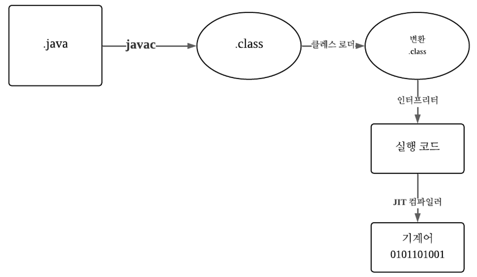
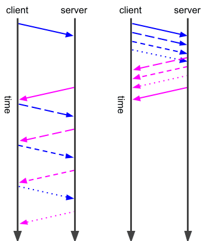

# 1. 모던 자바 소개

----

## 주요 내용

- 플랫폼 및 언어로서의 자바
- 새로운 자바 릴리스 모델
- 향상된 타입 추론(var)
- 인큐베이팅 및 프리뷰 기능
- 언어 변경하기
- 자바 11의 작은 변경사항

---

## 언어와 플랫폼
#### 자바(Java)의 두 가지 의미
“자바(Java)”라는 용어는 두 가지 관련된 개념을 지칭한다.

1. 자바 언어 (Java Language) <br>
→ 사람이 읽을 수 있는 프로그래밍 언어
2. 자바 플랫폼 (Java Platform) <br>
→ 자바 프로그램이 실행될 수 있는 환경

#### 자바 언어 (Java Language)
* 특징: 객체지향 프로그래밍 언어
* 형태: 사람이 읽고 작성하는 소스 코드 (.java)
* 처리 과정:
  * 자바 소스 파일을 작성한다. 
  * 이를 컴파일러(javac) 가 읽어 클래스 파일(.class) 로 변환한다.
* 역할: 프로그래밍의 문법, 타입 시스템, 제어 구조 등을 정의한다.

#### 자바 플랫폼 (Java Platform)
* 정의: 소프트웨어가 실행될 수 있는 환경(environment)
* 핵심 구성 요소:
  * JVM (Java Virtual Machine) → 클래스 파일을 로드하고 실행한다. 
  * 표준 라이브러리(Java API) → 언어의 기능을 확장하는 표준 클래스 집합
* 특징:
  * 자바 소스 코드를 직접 실행하지 않고, 클래스 파일을 링크 및 실행한다. 
  * 운영체제 위에서 동작하지만, 자바 애플리케이션은 OS에 의존하지 않는다.

#### 자바의 표준화와 사양 (Specifications)
자바가 성공적으로 발전할 수 있었던 이유 중 하나는 표준화(standardization) 덕분이다.
이는 “자바가 어떻게 작동해야 하는지”를 명확히 정의하는 명세(specification) 가 존재함을 의미한다.

주요 명세는 다음 두 가지다.
1. JLS (Java Language Specification)
   * 자바 언어의 문법, 타입 시스템, 의미론 등을 정의 
   * “자바 코드는 이렇게 작성되어야 한다”를 규정
2. JVM 사양 (JVM Specification, VMSpec)
   * 자바 바이트코드가 어떻게 실행되는지를 정의 
   * “클래스 파일은 이렇게 실행되어야 한다”를 규정

최근 자바에서는 이 두 명세의 분리를 매우 중요하게 여긴다.
즉, JVM 사양(VMSpec)은 JLS를 직접 참조하지 않는다.



일반적으로 자바 코드는 사람이 읽을수있는 자바 소스로 시작해서 javac에 의해 클래스파일로 컴파일 된후 JVM에 로드 된다. 
로드 과정에서 클래스를 조작하고 변경하는 것이 일반적인데, 가장 널리 사용되는 많은 자바 프레임워크가 클래스를 로드할 때 클래스를 
변환해서 인스트루먼네이션이나 자바 모듈 식별과 같은 동적 동작을 주입한다.

> ⛵ Instrumentation 이란?
> 프로그램의 실행 중에 그 내부 동작을 관찰하거나 제어하기 위해 코드를 삽입하는 기술을 말함.
> 자바 어플리케이션에 바이트코드를 가로채서 수정하거나 감시하는 기능
>
>```java
>public class MyAgent {
>	public static void premain(String args, Instumentation inst) {
>		System.out.println("Hello World!");
>		inst.addTransformer(new MyClassTransformer());
>	}
>}
>```
>이렇게 하면 MyClassTransformer가 클래스로딩 시점에 바이트코드를 변형 할 수 있다.

<br>

---
## 향상된 타입 추론(var 키워드)
자바 언어의 특징(특히 제네릭)으로, 개발자에게 코드 작성이 매우 길고 번거로웠다. 
그런데 최근 타입추론을 더 많이 사용하도록 발전되었다. 소스 코드 컴파일러의 이 기능을 사용하면 컴파일러가 프로그램의 일부 타입 정보를 자동으로 처리할 수 있게 됐다.
따라서 명시적으로 선언할 필요가 없어졌다.

자바5부터 제네릭 메서드는 제네릭 타입 인수에 대한 매우 제한된 타입 추론을 허용해서, 필요한 정확한 타입을 명시적으로 제공하지 않아도 되게됐다.

AS-IS
```java
List<String> list = Collections.<String>singletonList("hello");
```

TO-BE
```java
List<String> list = Collections.singletonList("hello");
```
이런식으로 메서드를 호출하는 방식은 너무 익숙해서 많은 개발자들이 명시적인 타입 인수가
있는 형식을 기억하기 어려울 수도 있다. 이런 변화는 타입추론이 그 역할을 잘하고 필요없는 코드를 제거해서
코드의 의미를 명확하게 한다는 의미였다.

타입추론에서 가장 중요한 개선은 제네릭 처리와 관련해서 자바 7에서 발생했는데
자바7 이전에는 다음과같은 코드를 보는게 일반적이었다.
AS-IS
```java
import java.util.*;

public class BeforeJava7 {
    public static void main(String[] args) {
        Map<String, List<Integer>> scores = new HashMap<String, List<Integer>>();
        scores.put("Alice", Arrays.asList(90, 80, 85));
        scores.put("Bob", Arrays.asList(70, 75, 60));
        System.out.println(scores);
    }
}
```

TO-BE
```java
import java.util.*;

public class AfterJava7 {
    public static <T> List<T> makeList(T... elements) {
        return Arrays.asList(elements);
    }

    public static void main(String[] args) {
        // 컴파일러가 1, 2, 3의 타입(Integer)을 보고 <Integer>를 자동 추론
        List<Integer> list = makeList(1, 2, 3);
        System.out.println(list);
    }
}
```

```java
// 자바 6에서는 중첩 제네릭 구조에서도 타입 추론이 가능해졌다.

// AS-IS
Map<String, List<Map<Integer, String>>> data = new HashMap<String, List<Map<Integer, String>>>();

// TO-BE
Map<String, List<Map<Integer, String>>> data = new HashMap<>();
```

자바 8에서는 람다 표현식 도입을 지원하기 위해 더많은 타입 추론이 추가 됐다.
```java
Function<String, Integer> lengthFn = s -> s.length();
```

현대의 자바에서는 로컬 변수 타입 추론, 즉 var라고 하는 기능이 도입되 타입 추론이 한단계 더 발전하게 됐다.
자바 10부터 추가가 되기 시작했고 타입이 아닌 변수 타입을 추론할 수 있도록 해준다.
```java
var names = new ArryList<String>();
```

var를 사용할때는 주의 할 점이 있는데,
```java
// 1. 초기화 식이 없으면 안된다.
var x;

// 2. null만으로는 타입 추론이 불가능하다.
var y = null;

// 3. 배열 리터럴만으로는 안된다.
var arr = new int[] {1, 2, 3};
// var arr2 = {1, 2, 3}

// 4. 메서드/생성자 시그니처, 필드, 반환 타입에는 사용 불가 (Java 10의 var는 "지역 변수" 전용)
public var value;             // 안 됨
public var f(var x) { ... }   // 안 됨
```

var에는 장단점이 존재하는데 장점으로는 
1. 가독성이 증가한다. 의미 있는 변수명 + 명확한 생성식 조합이면 이해하기가 쉽다.
2. 제네릭/중첩 타입에 강하다. 복잡한 타입이 있어도 선언이 쉽게 된다.
3. 컴파일 타임에 정확한 타입이 결정되어서 타입 안정성이 유지된다.

반대로 단점으로는
1. 타입이 눈에 보이지 않는다는 것.
```java
var result = userService.get(); // 이런식으로 get()이 무엇을 반환하는지 알 수 없다.
```
2. 광범위한 타입으로 보일 수 있어서 인터페이스를 반환할때 구체적인 타입 파악이 어렵고 복잡해진다. 복잡성이 높아진다는 것은 컴파일 시간이 길어지고 추론이 실패할 수 있는 원인이 다양해 진다는 것을 의미한다.

그래서 실무에서는
```java
var orders = new ArrayList<Order>(); // 이런 형태로 사용 o
var data = repo.findAll(); // (반환형이 불분명하면 문제가 생긴다) x
```

----

## 자바 11에서 작은 변경 사항
자바8 이후에 많은 기능들이 등장했다.

#### 컬랙션 팩토리(JEP 213)
'컬랙션 팩토리 메서드' 는 List, Set, Map 인터페이스의 static factory 메서드를 추가해서, "작은 수의 요소를 가지는 불변 컬랙션"을 손쉽게 생서할 수 있게 만든 것이다.
```java
// AS-IS
List<String> list = new ArrayList<>();
list.add("A");
list.add("B");
list.add("C");

// TO-BE
List<String> list = Arrays.asList("A", "B", "C"); // 수정 불가
```
이러한 형태로 간결하게 생성이 가능해졌다.

## HTTP/2(자바 11)
현대에 이르러서 HTTP 표준이 새로운 버전인 HTTP/2가 출시 됐다. 1997년 HTTP 1.1에서는 웹 어플리케이션의 성능에 관련해 고질적인 문제가 있다.
* 헤드 오브 라인 블로킹
* 단일 사이트로 제한된 연결
* HTTP 제어 헤더 성능 오버헤드

HTTP/2는 오늘날 웹이 실제로 동작하는 방식과 맞지 않는, 이런 근본적인 성능 문제를 해결하는데 중점을 둔
프로토콜 전송 계층에 대한 업데이트다. 클라이언트와 서버간의 바이트 흐름 방식에 중점을 둔 HTTP/2는 실제로 요청/응답, 헤더, 상태 코드, 응답 바디와 같은 많은 익숙한 HTTP 개념을 변경하지 않았다.
이런 개념은 HTTP/2와 HTTP 1.1에서 의미상 동일하게 유지된다.

그럼 헤드오브 라인 블로킹은 뭘까?
### 헤드 오브 라인 블로킹
HTTP/1.1에서는 브라우저가 서버로 여러 요청을 보낼 때,
기본적으로 하나의 TCP 연결에서 요청을 순차적으로 처리한다.

> 요청1 -> 응답1 -> 요청2 -> 응답2 -> 요청3 -> 응답3 ...
 
이 구조에서 앞선 요청이 끝나기 전까지는 뒤의 요청이 대기 상태가 된다.
이것이 헤드 오브 라인 블로킹이다. 큐의 맨 앞에 있는 요청에 막혀 나머지 요청 전체의 흐름을 막는다.

같은 연결에서 한 번에 하나의 응답만 처리하는동작은 HTTP 기반의 서비스와 통신해야하는 JVM 애플리케이션에 제한을 줄수 있었다.

### HTTP1.1(좌) 과 HTTP/2(우)의 멀티플렉싱 차이


HTTP/2는 처음부터 동일한 연결에서 요청을 다중화 한다. 클라이언트와 서버간의 다중 스트림이 항상 지원되고, 단일 요청의 헤더와 본문을 별도로 수신 할 수 도있다.

### 제한된 연결
HTTP1.1 사양에서는 서버에 대한 연결을 한번에 두 개로 제한할 것을 권장했다. 의무는 아니었고 권고로 명시되어 있었는데, 이러한 이유는 동시 다운로드 때문이었다.
TCP에 3way handshake과정이 반복되면서 효율이 매우 급감하기 때문이다.

그래서 HTTP1.1을 사용하던 개발자들은 여러 도메인으로 나누어 사이트 서비스를 제공했었다. 이를 도메인 샤딩이라고 했는데,
브라우저는 각 도메인마다 6개 연결을 열 수 있으므로 총 18개의 리소스를 병렬로 다운로드 할수 있었다.

하지만 이 방법도 단점이 많았는데, SSL/TLS 핸드세이크의 비용이 증가했고, 쿠키의 동기화 문제가, DNS 조회 횟수 증가가 있었다.

하지만 HTTP2에서는 이런 상황을 해결할수 있게 됐다. 
각 연결을 효과 적으로 사용하여 원하는 만큼의 동시 요청을 수행 할 수 있다. 
브라우저는 특정 도메인에 대해 하나의 연결만 열지만 동일한 
연결을 통해 동시에 많은 요청을 수행할 수 있다.

그리고 내부적으로 Stream 단위로 분리해서 전송이가능했다.  

### HTTP 헤더 성능
HTTP의 중요한 특징 중 하나는 요청과 함께 헤더를 전송하는 것이다. 
HTTP 프로토콜 자체가 상태를 유지하지 않지만, 애플리케이션에서 요청 간 상태를 유지할 수 있게 해준다.
(예를들어 사용자가 로그인 한 사실.) 
```text
GET /api/user HTTP/1.1
Host: example.com
User-Agent: Chrome/122.0
Accept: text/html
Accept-Encoding: gzip, deflate
Cookie: session_id=abc123; user_id=42
```
이 요청이 페이지 내의 모든 리소스 요청(CSS, JS, 이미지 등)에 반복된다면 어떻게 될까?
같은 헤더 정보가 매번 전송될것이다.

네이버 메인 페이지를 생각해보면, 페이지 내부에는 주식, 뉴스, 쇼핑, 웹툰 등 여러가지 컨텐츠가 한꺼번에 올라오는걸 알 수 있다.
그래서 과거 HTTP1.1에서는 도메인을 분리(샤딩)을 했는데. 이후에는 하나의 연결(예: www.naver.com)로 모든 리소스를 동시에 요청이 가능하게 벼꼈고
여러 요청을 stream 단위로 분리해서 전송이 가능하게 바뀌었다.

헤더는 HPACK으로 압축돼서 “User-Agent”, “Cookie” 같은 중복 데이터는
첫 요청 이후엔 전송 안 해도 되도록 했다.

### 그래서 자바 11과 HTTP/2는 무슨 상관이 있나?
공식적으로 자바 11은 HTTP/2를 공식적으로 지원하는 첫 버전이 되었다.
HTTP 통신은 프로토콜인데 자바는 도구(클라이언트) 이다. 데이터를 어떻게 전송할지를 정의하는 표준규약인 HTTP/2를
자바11에서부터는 API를 통해 HTTP/2를 이해하고 사용할 수 있는 API가 제공되었다.

```java
// 요청을 위한 HttpClient 인스턴스를 생성
HttpClient client = HttpClient.newBuilder()
        .version(HttpClient.Version.HTTP_2)
        .build();

// HttpRequest 인스턴스를 사용해서 구글에 대한 특정 요청을 생성
HttpRequest request = HttpRequest.newBuilder()
        .uri(URI.create("https://naver.com"))
        .build();

// HTTP 요청을 동기적으로 실행해서 그 응답을 저장한다. 이 줄은 요청이 완료될때 까지 블로킹됨 
HttpResponse<String> response = client.send(
        request, 
        HttpResponse.BodyHandlers.ofString( // send 메서드는 응답 본문을 어떻게 처리할지 알려주는 핸들러가 필요하다.
                                            // 여기서는 표준 헨들러를 사용해서 본문을 문자열로 반환한다.
            Charset.defaultCharset()));

System.out.println(response.version()); 
```

이것은 api의 동기적 사용을 보여준다. 요청과 클라이언트를 생성하고 send 메서드를 사용해소 HTTP 호출을 실행한다. 
jdk의 이전 HTTP api와 마찬가지로 전체 http 호출이 완료될때 까지 응답객체르 받지 못한다.

### 그래서 이렇게 되면 뭐가 좋은가?
자바 11에서 부터는 HTTP 호출을 표준적으로 안정하게 기능을 지원하게 되는것이 핵심이다.
이전까지 HttpURLConnection이 너무 오래된 API였고, 제대로 동작시키기 위해서는 
try-catch, InputStream, BufferedReader 등 복잡했다. 또는 외부 라이브러리(OkHttp, Apache HttpClient)를 써야 했다.

자바 11부터는 java.net.http.HttpClient가 JDK에 내장되면서 HTTP1.1과 HTTP/2 모두 지원하게 되었고
HttpRequest, HttpResponse 객체 중심으로 명확한 구조를 같게 되었다.
이로서 외부라이브러리 없이도 HTTP기능을 쓸수있게되었다.

### HTTP/2의 가장 큰 장점 '멀티플랙싱'
멀티플랙싱은 동기방식(send()) 방식으로는 살리기가 어렵다.
그래서 자바 11은 비동기방식(sendAsync()) 방식을 제공한다.

이 비동기 방식은 CompletableFuture를 반환해서 여러 요청을 도시에 실행할 수 있고,
HTTP/2의 병렬 스트림 전송 능력을 100% 활용할 수 있게 되었다.

```java
var client = HttpClient.newBuilder().build();
var uri = new URI("https://google.com");
var request = HttpRequest.newBuilder(uri).build();
var handler = HttpResponse.BodyHandlers.ofString();

CompletableFuture.allOf(
    client.sendAsync(request, handler)
        .thenAccept(resp -> System.out.println(resp.body())),
    client.sendAsync(request, handler)
        .thenAccept(resp -> System.out.println(resp.body())),
    client.sendAsync(request, handler)
        .thenAccept(resp -> System.out.println(resp.body()))
).join();
```
1. sendAsync()는 비동기적으로 요청을 전송한다. 즉, 반환을 기다리지 않게된다.
2. 각 요청은 CompletableFuture를 반환 한다.
3. .thenAccept(...) 응답이 도착하면 실행할 동작을 정의한다
4. CompletableFuture.allOf(...).join() -> 모든요청이 완료될때까지 기다린다.
즉, 3개의 HTTP 요청을 동시에 보내고, 모두 끝나면 결과를 출력한다"는 의미이다
이렇게하면 Concurrency를 높이고 HTTP/2 멀티플렉싱 효과를 제대로 누릴 수 있다.

